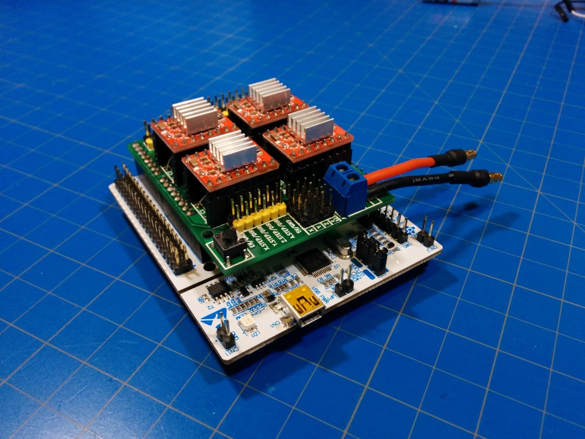

# StepperHub

If you need something to run up to 3 steppers via UART interface (or USB-to-UART), with maximum possible speeds, simulataneously and for cheap - you got to the right place!

##Hardware

  - [Arduino CNC Shield with A4988 or DRV8825 driver boards](http://www.ebay.com/itm/CNC-kit-2-1X-Shield-4X-A4988-Drivers-for-Arduino-UNO-R3-ATmega328P-CH340G-/201552649446?hash=item2eed795ce6:g:E~UAAOSwGYVW~XXA)
  - [STM32 Nucleo-F446RE](http://www.digikey.com/product-detail/en/stmicroelectronics/NUCLEO-F446RE/497-15882-ND/5347712)

Arduino Shield with stepper drivers (but without Arduino itself) you may get for for around 10$.
Nucleo 64 boards priced in a range of 10..15$ (depennding on exact model and place you get it).
So you get efficient UART (or USB-to-UART) 3-axis stepper controller for 20$. 
  
##Build/Dev Tools

  - [Cube MX](http://www.st.com/stm32cube)
  - [Keil uVision](http://www.keil.com/uvision/)

##Preface

I have been looking for UART stepper controller to build an PAN-TILT-ROLL motorized stage. 
If balanced - you can avoid using gearboxes (putting up to 5 lb on a single 5mm NEMA17 axis works just fine, just balance the mass arround the axis). But you will get another problem - inertia of huge masses. You can't put stepper into fast speed immediately, it just will not go (it will jerk skipping the steps). Sure, you may set very huge timing between steps to get that mass into rotation, but it will rotate extremly slow unless you accelerate step-timing over time. 

So in my search of cheap stepper controller which can do the job I've found [Arduino CNC Shield V3](http://http://blog.protoneer.co.nz/arduino-cnc-shield/). But Arduino's AVR controller is extremly weak. If you need to run acceleration profiles with high speeds for multiple motors simultaneously - you better get something more powerfull.

I just love TI ARM controllers (TM4C123 series). With full speed 16/32 or 32/64-bit timers they amazingly fit for this task (these controller can run up to 18 timers in 32-bit mode). But I am too lazy to prototype/DIY the board with TI controller to host Arduino CNC Shield. Luckily there are [STM32 Nucleo 64](http://ww.st.com/stm32nucleo) dev borads that come with arduino-pinout. They have very juicy STM32F4 controllers. These controllers have just two 32-bit itmers, and like a dozen 16-bit timers. So I've decided to go with 16-bit timers with 16-bit prescaller - less precision but does the job. 

[Here](https://youtu.be/D3u7s1SLicY) is a demo video of eBay NEMA17 running at 3400rpm in 16x microstepping mode.
[And here](https://youtu.be/ANXc6-onQKg) is a demo video of how to use the UART prtotocol.

##Implementation description

Each A4988 driver board needs two I/O signals to operate:

  - Stepping pulse;
  - Direction;

3 timers (TIM1, TIM2 and TIM3) configured to run in PWM mode using timer output channels (so the stepping pulse pin signalled automatically by TIM pheripheral).

  - X axis - TIM1, PWM stepping pulses at PA10, Direction GPIO out at PB4
  - Y axis - TIM2, PWM stepping pulses at PB3,  Direction GPIO out at PB10
  - Z axis - TIM3, PWM stepping pulses at PB5,  Direction GPIO out at PA8

The TIM_UPDATE interrupt handler is also enabled for each timer. It is used to count PWM steps pulses. These iterrupts configured with highest priority to others. So we don't miss the steps count and can easily run all three motros at 400kHz. Step pulse pin however is not flipped in interrupt handler programatically (as been said - this happens through PWM mode). PWM guarantees uniform pulsing, while interrupt handler routine is always a bit delayed and the delay duration varies every time (not much, tens to hundreds of nanoseconds, but at high speed this is critical).

There is one more timer configured - TIM14. 
It runs in a regular mode, simply excuting its TIM_UPDATE interrupt routine every 50 microseconds. This is a stepper controller timer, it checks the current speed of each connected mottor, estimates the time left to reach the destination (target step number) and comperas it with the time required to reduce the speed to the minimum (starting/stopping step time). And changes the speed accodringly (accellerating/decelerating the motor, or just keeping it at maximum allowed speed).

##UART Portocol

####REQUEST STRUCTURE

    <command><stepper>[.parameter][:value]

where

    <command>     : add | set | reset | get
    <stepper>     : X | Y | Z  (or whatever single-letter names will be added in the future)
    [.parameter]  : parameter name (the field of the stepper_state structure)
    [:value]      : any 32-bit signed integer value (-2147483648 .. 2147483647)

  - **get** - returns the current value of the [parameter] 
  - **add** - adds [value] to the current [parameter] value
  - **set** - sets new [value] to the [parameter]
  - **reset** - resets the [parameter] to its factory default (may used with ".all")

read/write params (supported by all commands):

    .targetPostion    (default: 0)      - where motor should go, may be udated at ANY time
    .currentPostion   (default: 0)      - where the motor now, may be updated when motor is STOPPED
    .minSPS           (default: 1)      - minimum/starting speed (steps-per-second), may be updated when motor is STOPPED
    .maxSPS           (default: 400000) - maximum speed (steps-per-second), may be updated when motor is STOPPED

read-only params ("get" command only):

    .currentSPS       default: 1        - current stepper speed (steps-per-second), equals to minSPS when STOPPED
    .accSPS           default: 1        - acceleration (steps-per-second added on every speed-control timer event when RUNNING)
    .accPrescaller    default: 22503    - acceleration prescaler (for speed-control timer)                 
    .status           default: STOPPED  - current motor status (RUNNING, BREAKING, RUNNING_FORWARD, RUNNING_BACKWARD)
    .all              default: N/A      - returns all pramter values, may be used with "reset" command when motor is STOPPED

  - **minSPS** and **maxSPS** are stored in internal flash memory, so preserved after power-off.
  - **accSPS** and **accPrescaller** recalculated every time when new value for **minSPS** is set, to provide acceleration at 80% of starting speed.

**[.parameter]** and/or **[:value]** might be omitted, so defaults will be used instead:

- when the **[.parameter]** is omitted  for **add** or **set** commands - **.targetPosition** assumed by default
- when the **[.parameter]** is omitted  for **get** command - **.currentPosition** assumed by default
- when the **[.parameter]** is omitted  for **reset** command - **.all** assumed by default
- when the **[:value]** is omitted -  **0** assumed by default (for all commands)

**[:value]** makes no sense for **get** and **reset** commands, so will be ignored in these cases

**Requests are case-insensitive**, e.g. **setZ.minSPS:100** is equvivalent to **setz.minsps:100**

Requests can be sent in a row without any seprators, e.g. **setZ.minSPS:100addZ:2000setX:5000** will work. Each request get into execution when any next character arrives which may idicate the end of the request (e.g. cariege return, or the begining of next request).

####RESPONSE STRUCTURE

    <status> - <code|stepper><info>
  
where

    <status>  : OK | LIMIT | ERROR
    <info>    : command confirmation info (in case of successful "OK", or error code and description in case of error)

####EXAMPLES

  -------------------------------------------
  
  REQUEST
    
      setZ.minSPS:16000
    
  RESPONSE
      
      OK - Z.MINSPS = 16000

  -------------------------------------------
  
  REQUEST
    
      setX.minSPS
      
  RESPONSE
      
      LIMIT - Z.MINSPS = 1
      
  No value provided means that we were trying to set 0 value to the minSPS paramer, so minSPS has been reduced to the minimum posible value

  -------------------------------------------
  
  REQUEST
    
      addZ:6400000
    
  RESPONSE
      
      OK - Z.TARGETPOSITION = 7052800

    -------------------------------------------
  
  REQUEST
    
      getZ
    
  RESPONSE
      
      OK - Z.CURRENTPOSITION = 3381833

  -------------------------------------------
  
  REQUEST
    
      getZ.all
    
  RESPONSE
    
      OK - Z
      	.TARGETPOSITION = 7052800
      	.CURRENTPOSITION = 4388708
      	.MINSPS = 16000
      	.MAXSPS = 128000
      	.CURRENTSPS = 128000
      	.ACCSPS = 2
      	.ACCPRESCALER = 3
      	.STATUS = 0x02 RUNNING_FORWARD

  -------------------------------------------

##WARNING

####Generating code with CubeMX project will give you an error message. Now worries - its OK!

I've have overclocked CPU to 200MHz to get simpler calculations of timing parameters, so easier to debug. Its just about 10% over spec. Playing with overclocking I was able to run this poor CPU at 280 MHz, getting close to 50MHz flipping GPIO PIN in a loop.

